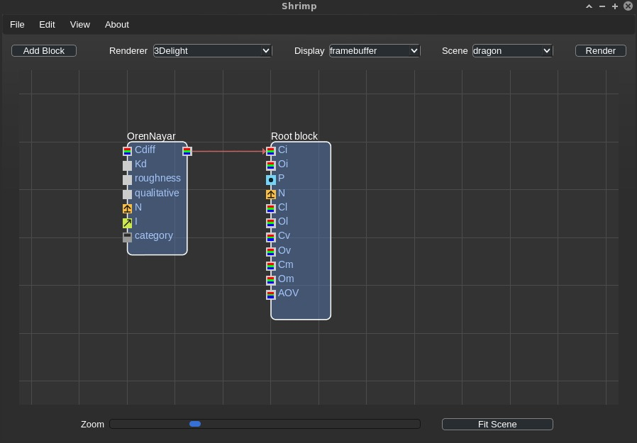
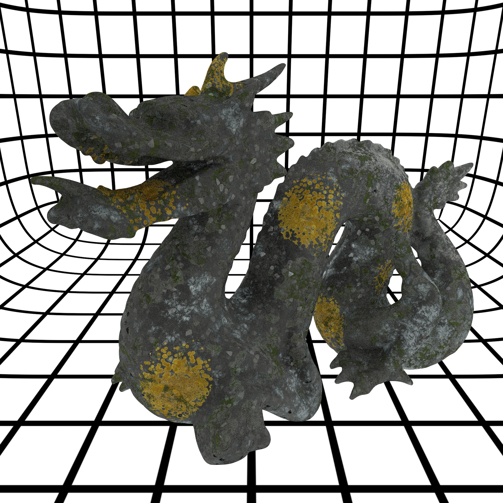
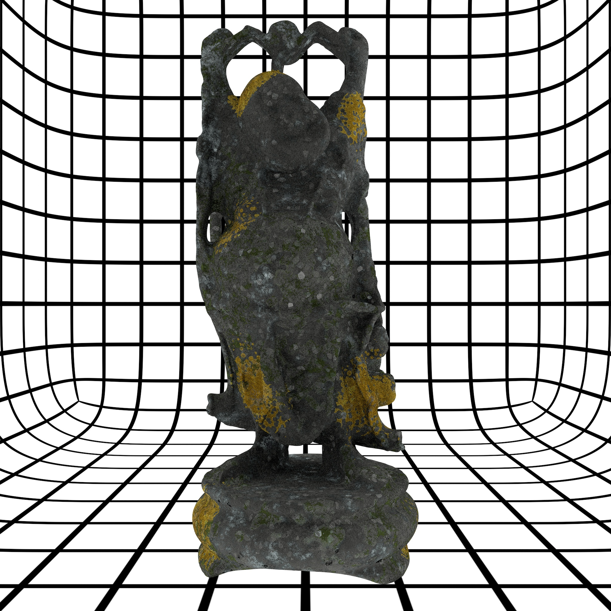

# Shrimp

[](https://travis-ci.org/luisbarrancos/shrimp)[](https://www.gnu.org/licenses/gpl-3.0)
 
A copy of the [Shrimp](https://sourceforge.net/projects/shrimp/) [RenderMan Shading Language](https://renderman.pixar.com/resources/RenderMan_20/shadingLanguage.html) shader building tool, that exposed RSL's functions as building blocks. In that regard it was more of a shader building tool than a shader network building tool.

This contains all the development history that was spread amongst the CVS, SVN and Mercurial branches, for the historical [GTK 1.x](https://www.gtk.org/download/) application, [FLTK2](http://fltk.org/doc-2.0/html/), and finally [Qt4](https://doc.qt.io/qt-4.8/) GUI/frontend.

- - - - - 

### Why?

RSL was deprecated in the latest RenderMan versions, the code is provided as a learning/didactic resource.
The latest version of [PRman](https://renderman.pixar.com/resources/RenderMan_20/home.html) to support RSL was version 20.0. 
[3Delight](http://www.3delight.com/en/index.php?page=3DSP_overview) version (up to) 12.5 is also supported.

#### Building

Unless you're into software archeology, the sanest choice is to just use Qt4:
```bash
qmake-qt4 shrimp.pro
make all
```

#### Using

As an example, using [3Delight](http://www.3delight.com/en/index.php?page=3DSP_overview), then make sure you have your 3Delight environment variables set.
```bash
export DELIGHT=/path/to/3delight
export LD_LIBRARY_PATH=${DELIGHT}/lib:${LD_LIBRARY_PATH}
export PATH=$PATH:${DELIGHT}/bin
```
and add
```bash
export DL_RESOURCES_PATH=/path/to/shrimp_repo/data/rib/scenes/archives
export DL_SHADERS_PATH=${HOME}/.shrimp/temp
```

Start the application, and off you go.



#### Examples

See some of the examples included


Which results in




More examples below:


